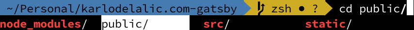

If you want to become a better developer, you must learn to be efficient at communicating with your computer. This means putting your entire focus on the problem at hand, and not wasting any time with menial tasks. This article will show you how to become more efficient with the terminal.
<!-- end -->
If you, like most developers, rely on the terminal to do certain tasks such as, communicating with a remote server, configuring applications, setting up environments, then you should be familiar with the pain of remembering commands or fiddling with the terminal history to get to your desired command. Remembering and typing out commands may only take a few seconds but these seconds accumulate over time.

## Autosuggest

Initially, it may not seem like a big deal to type out something like `ssh root@server.myhost.com:9123` each time you want to connect to your remote server, but then, if you realize that you might type this out multiple times a day, then you should also realize that there has to be a better way of doing this. After all, a part of writing efficient and quality code is minimizing duplications and unnecessary work.

With OhMyZsh and a few plugins, you can save yourself the pain of remembering and typing commands such as these.

Taking the `ssh` command example from above, with OhMyZsh configured, you could simply begin typing `ssh root@ser` and then you would get a shadow text which would show you the most recently executed command that matches your input. You can then complete the command simply by pressing the → key.

## Word jumps and word deletion

Have you ever typed out or copy-pasted a long command only to realize that you need to change something in the middle of the command? Well, you probably have and to make the change, you probably had to spam your ← key multiple times. With word jumps, you can avoid this nonsense by simple pressing `option + ←` just a few times to reach your desired point in the command. This is especially useful for developers with defective Macbook keyboard buttons which can give at any moment.

This works likewise with word deletion. Pressing `delete + ←` yields the same, except that it deletes each word.

## Github information

A seemingly small but welcome feature is the Github info which is display when your working directory is inside of a git repo. It displays which branch is currently checked out, whether there are changes made, and whether they are staged.

## Cycle through files in a directory

When you need to `cd` into a specific directory or just execute a command such as `cp` on a specific file, you can type `cd` and then press `tab` to cycle through all of the options. Unlike zsh, bash only lists the entries which can be used with the command.

## And many more...

Oh My Zsh has an extensive community who have come up with many similar innovations. If you are interested in the above, I definitely suggest the you install Oh My Zsh and give all of these a try!

## Installation

When showing this wonderful piece of software to my peers, I usually refer them to this Github gist found [here](https://gist.github.com/kevin-smets/8568070#how-to-install). It will show you have to install iTerm 2, Oh My Zsh, and all of the features that I listed above.

---
__I hope you enjoyed this article and found it to be worthwhile. You can check out all my projects on [Github](https://github.com/kdelalic) and don’t hesitate to reach out to me on [Twitter](https://twitter.com/karlodelalic)!__
